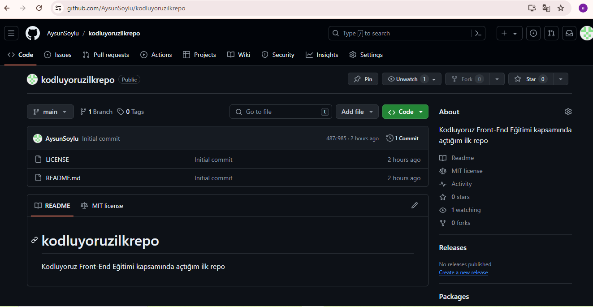

# Kodluyoruz Ilk Repo

Bu repo [Kodluyoruz] (https://www.kodluyoruz.org) Front-End eğitiminde oluşturduğumuz ilk repo. İçerisinde bir adet README dosyası, bir adet de index.html barındırıyor.

![github] (figures/github.png)

## Installatıon

Öncelikle projeyi clonelayın. (Buraya sizin reponuzdan aldığınız link gelecek)

'''bash
git clone https://github.com/AysunSoylu/kodluyoruzilkrepo.git
'''

## usage

Projeyi cloneladıktan sonra Visual Studio Code programında açınız.

Linux için:
'''linux
cd kodluyoruzilkrepo
code .
'''

## contributing
Pull requestler kabul edilir. Büyük değişiklikler için, lütfen önce neyi değiştirmek istediğinizi tartışmak için bir konu açınız.

## License
[Mit] (https://choosealicense.com/licenses/mit/)

